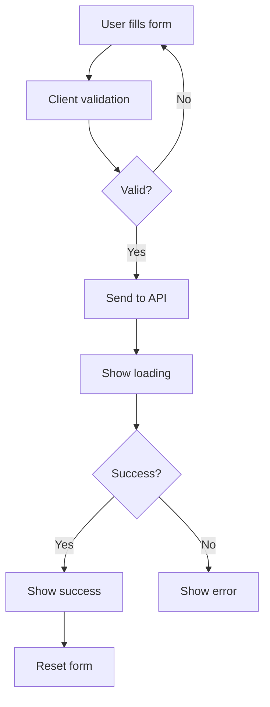

<div align="center">

# ⚛️ Aswin's Portfolio - Frontend

[](https://reactjs.org/)
[](https://vitejs.dev/)
[](https://sass-lang.com/)
[](https://www.framer.com/motion/)
[](https://reactrouter.com/)
[](https://www.netlify.com/)
[](https://www.typescriptlang.org/)


### A modern, responsive React-based frontend for Aswin Hariram's portfolio website.
### Features a clean UI with smooth animations, an AI-powered chatbot assistant, and responsive design for all device sizes.

[](https://opensource.org/licenses/MIT)
[](http://makeapullrequest.com)
[](https://reactjs.org/)

</div>

## ✨ Features

<div align="center">

| Feature | Description |
|---------|-------------|
| 🎨 **Modern UI/UX** | Built with React 18 and styled with SCSS modules |
| 📱 **Responsive Design** | Fully responsive layout that works on all devices |
| 🎭 **Smooth Animations** | Implemented using Framer Motion for buttery smooth transitions |
| 🤖 **AI Chatbot** | Interactive assistant powered by LangChain and OpenAI |
| 📧 **Contact Form** | Secure form with validation and real-time feedback |
| 📝 **Markdown Support** | Renders rich text content with React Markdown |
| 🌓 **Dark/Light Mode** | Built-in theme switcher |
| ⚡ **Optimized Performance** | Code splitting and lazy loading for fast load times |


</div>

## 🛠️ Tech Stack

<div align="center">

| Category | Technologies |
|----------|--------------|  
| **Frontend** | [](https://reactjs.org/) [](https://vitejs.dev/) [](https://www.typescriptlang.org/) |
| **Styling** | [](https://sass-lang.com/) [](https://developer.mozilla.org/en-US/docs/Web/CSS/Using_CSS_custom_properties) |
| **Animation** | [](https://www.framer.com/motion/) [](https://greensock.com/gsap/) |
| **State Management** | [](https://reactjs.org/docs/context.html) |
| **Routing** | [](https://reactrouter.com/) |
| **Form Handling** | [](https://react-hook-form.com/) |
| **Markdown** | [](https://remarkjs.github.io/react-markdown/) |
| **API** | [](https://axios-http.com/) [](https://developer.mozilla.org/en-US/docs/Web/API/WebSockets_API) |
| **Testing** | [](https://jestjs.io/) [](https://testing-library.com/docs/react-testing-library/intro/) |
| **Linting** | [](https://eslint.org/) [](https://prettier.io/) |

</div>

### Key Dependencies

<div align="center">

```json
{
  "@emailjs/browser": "^3.11.0",
  "@gsap/react": "^2.1.2",
  "@headlessui/react": "^2.2.2",
  "framer-motion": "^10.18.0",
  "react": "^18.2.0",
  "react-dom": "^18.2.0",
  "react-markdown": "^10.1.0",
  "react-router-dom": "^7.5.3",
  "sass": "^1.68.0"
}
```

[](https://reactjs.org/)
[](https://www.framer.com/motion/)
[](https://reactrouter.com/)

</div>

## 🔧 Project Structure

<div align="center">

```
Frontend/
├── 📁 public/             # Static assets
├── 📂 src/
│   ├── 🎟️ components/     # Reusable UI components
│   │   ├── 🤖 chatbot/    # AI assistant implementation
│   │   └── ...         # Other components
│   ├── 🖼️ pages/          # Application pages
│   ├── 🎨 styles/         # Global styles
│   ├── ⚛️ App.jsx         # Main application component
│   └── 🚀 main.jsx        # Application entry point
├── 📃 .env                # Environment variables
├── 🐳 Dockerfile          # Docker configuration
├── ⚙️ nginx.conf          # Nginx configuration for production
└── 📎 package.json        # Dependencies and scripts
```

</div>

## 📋 Prerequisites

<div align="center">

[](https://nodejs.org/)
[](https://www.npmjs.com/)
[](https://yarnpkg.com/)

</div>

## 🚀 Getting Started

### Installation

<details>
<summary>📋 Step-by-Step Setup Guide</summary>

#### 1. Clone the repository and navigate to the Frontend directory:
```bash
git clone <repository-url>
cd my-portfolio-2.0/Frontend
```

#### 2. Install dependencies:
```bash
npm install
# or
yarn install
```

#### 3. Create a `.env` file with the following variables:
```
VITE_API_URL=http://localhost:5001
VITE_CHAT_API_URL=http://localhost:5001/chat
VITE_CONTACT_URL=http://localhost:5001/contact
VITE_RESUME_URL=<your-resume-url>
```
</details>

### Development

<div align="center">

[](https://vitejs.dev/)

```bash
npm run dev
# or
yarn dev
```

The application will be available at http://localhost:5173

### Building for Production

[](https://vitejs.dev/guide/build.html)

```bash
npm run build
# or
yarn build
```

The built files will be in the `dist` directory.

</div>

## 🐳 Docker

<div align="center">

[](https://www.docker.com/)

```bash
docker build -t portfolio-frontend .
docker run -p 3000:80 portfolio-frontend
```


</div>

## 📚 Key Components

<div align="center">


</div>

### Chatbot

The AI-powered chatbot assistant (`src/components/chatbot/Chatbot.jsx`) provides an interactive way for visitors to learn about Aswin's skills, projects, and experience. It communicates with the backend API to process questions and display responses.

<div align="center">

| Feature | Description |
|---------|-------------|
| 💬 **Real-time Messaging** | Interactive conversation interface |
| 📝 **Markdown Rendering** | Formatted responses with syntax highlighting |
| 👉 **Quick Responses** | Buttons for common questions |
| 📱 **Mobile-friendly** | Adaptive keyboard and responsive design |

</div>

## 🌐 API Integration

<div align="center">


</div>

The frontend communicates with the backend API for:

<div align="center">

| Integration | Purpose |
|------------|---------|  
| 🤖 **Chatbot** | Sends messages and receives AI-generated responses |
| 📧 **Contact Form** | Submits user inquiries with contact details |

</div>

API endpoints are configured through environment variables for flexibility across different environments.

### Contact Form Integration

The contact form (`src/components/contact/ContactForm.jsx`) provides a user-friendly interface for visitors to send messages.

<div align="center">

| Feature | Description |
|---------|-------------|
| ✅ **Form Validation** | Client-side validation for required fields and email format |
| 💻 **Status Feedback** | Visual indicators for loading, success, and error states |
| 📱 **Responsive Design** | Adapts to different screen sizes |
| ✨ **Animation** | Smooth animations using Framer Motion |

</div>

#### Contact Form Workflow:

<div align="center">



</div>

## 🚢 Deployment

<div align="center">

[](https://vercel.com/new/git/external)

The frontend is configured for deployment on Vercel and is currently hosted at:

[https://aswin-hariram.vercel.app/](https://aswin-hariram.vercel.app/)


</div>

## 📄 License

<div align="center">

[](https://opensource.org/licenses/MIT)

This project is licensed under the MIT License.

</div>

---

<div align="center">


### Developed by Aswin Hariram

[](https://github.com/your-username)
[](https://linkedin.com/in/your-profile)
[](https://aswin-hariram.vercel.app/)

</div>
